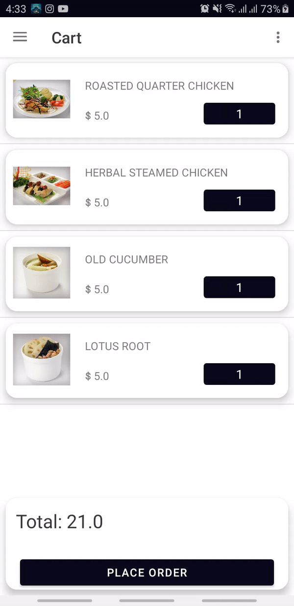

# SwipeRecycler
SwipeRecyclerView

  	allprojects {
		repositories {
			...
			maven { url 'https://jitpack.io' }
		}
	}
  
    dependencies {
	         implementation 'com.github.ahmedwasfe:SwipeRecycler:1.1'
	}

# Docs

	RecyclerView recyclerView = findViewById(R.id.recycler_view);

        SwipeRecyclerViewHelper swipeRecyclerViewHelper = new SwipeRecyclerViewHelper(
                this, recyclerView, 200) {
            @Override
            public void instantiateButton(RecyclerView.ViewHolder viewHolder, List<MButton> mListMButton) {
                mListMButton.add(new MButton(MainActivity.this, "Your Text",
                        30, 0, Color.parseColor("#FF3C30"), new IButtonClickLitener() {
                    @Override
                    public void onButtonClick(int position) {
                        Toast.makeText(MainActivity.this, "Item : " + position, Toast.LENGTH_SHORT).show();
                    }
                }));
            }
        };
